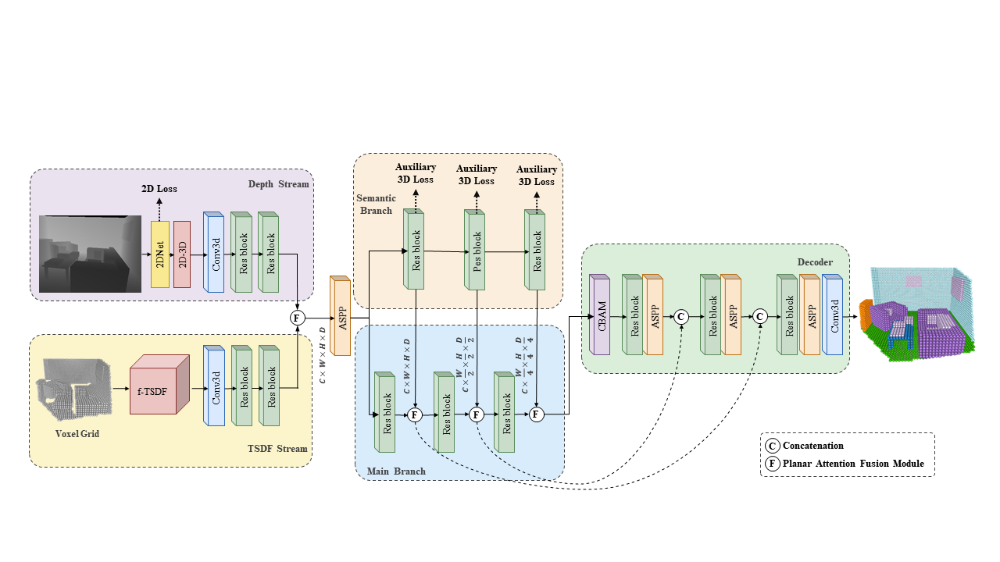
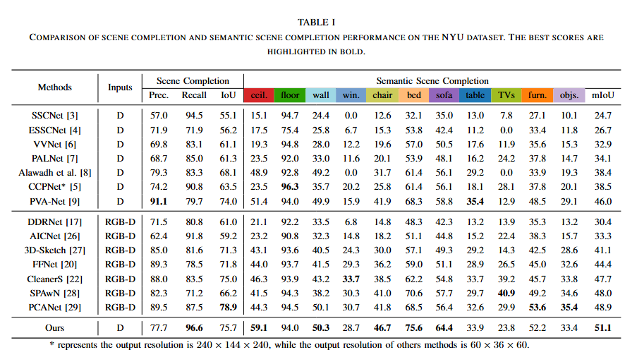
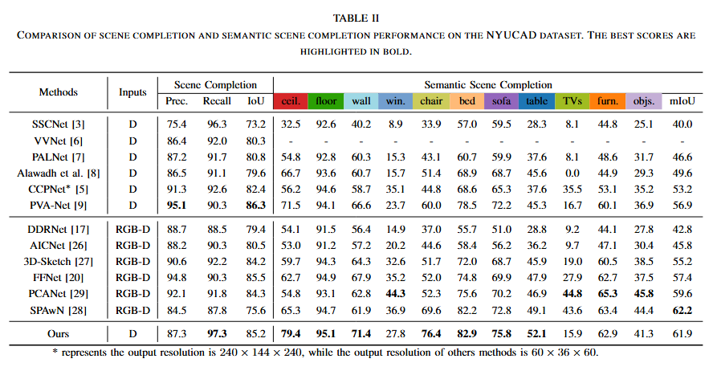

# Semantic Decoupling based Semantic Scene Completion from a Single Depth Image


## Introduction

This repository contains the source code for the paper Semantic Decoupling based Semantic Scene Completion from a Single Depth Image


## Overall 


## Comparisons with SOTA

### The NYU dataset


### The NYUCAD dataset


### Visual results

|    Dataset    |                   Link                   |
| :----------: | :--------------------------------------: |
|NYU|[Google Drive](https://drive.google.com/drive/folders/1uYdPG6fpdXqjARoHTufYbCTuUKrX_1ta?usp=sharing)|
|NYUCAD|[Google Drive](https://drive.google.com/drive/folders/1whNr5zx6Mb4h9oqeBnkLwqQHUG_nf_cJ?usp=sharing)|
## Usage

### Installation
1. You can use the following command to install dependencies.
```
conda create -n ssc python=3.8
conda activate ssc
conda install pytorch==1.12.1 torchvision==0.13.1 torchaudio==0.12.1 cudatoolkit=11.3 -c pytorch
```
2. Install requirements

```
torch-scatter
pyyaml
tqdm
imageio
h5py
pandas
Pillow
scikit-learn
scikit-image
scipy
PyYAML
```
You can install them by running  `pip install -r requirements.txt` .
### Datasets

We use the NYU and NYUCAD datasets in our experiments. 
After preparing, the `SSC_Dataset` folder should look like this:

````
|-- SSC_Dataset
  | NYU
    |-- Depth
    |-- TSDF
    |-- label2d
    |-- LABEL
    |-- train.txt
    |-- test.txt
  | NYUCAD
    |-- Depth
    |-- TSDF
````

### Training
Edit the `train.py`, then run
```
python train.py
```
### Inference
Edit the `eval.py`, then run
```
python eval.py
```
